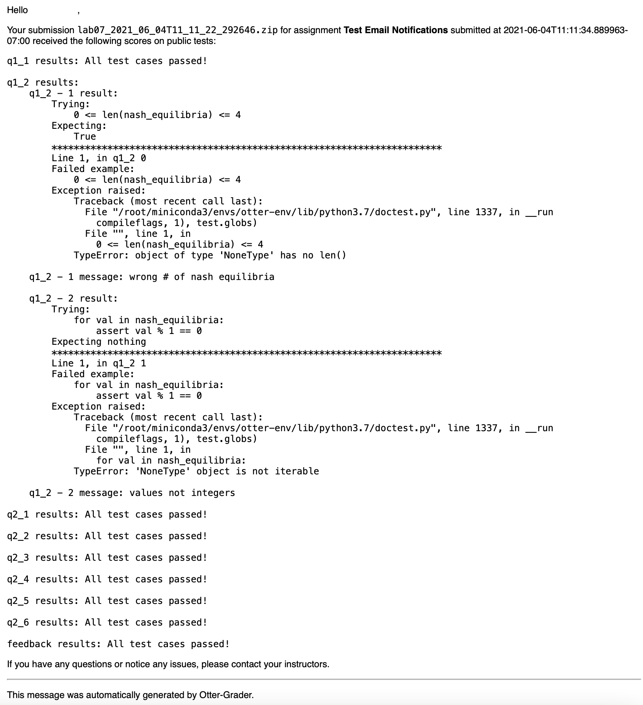

# Gmail Notifications

This plugin sends students an email summary of the results of their public test cases using the Gmail API. To use this plugin, you must set up a Google Cloud project and create an OAuth2 Client that can be used as a proxy for another email address.

## Setup

Before using this plugin, you must first create Google OAuth2 credentials on a Google Cloud project. Using these credentials, you must then obtain a refresh token that connects these credentials to the account from which you want to send the emails. Once you have the credentials, use the `gmail_oauth2` CLI included with Otter to generate the refresh token. Use the command below to perform this action, substituting in your credentials client ID and secret.

```console
gmail_oauth2 --generate_oauth2_token --client_id="<client_id>" --client_secret="<client_secret>" --scope="https://www.googleapis.com/auth/gmail.send"
```

This command will prompt you to visit a URL and authenticate with Google, which will then provide you with a verification code that you should enter back in the CLI. You will then be provided with your refresh token.

## Configuration

This plugin requires four configurations: the Google client ID, client secret, refresh token, and the email address from which emails are being sent (the same one used to authenticate for the refresh token).

```yaml
plugins:
    - otter.plugins.builtin.GmailNotifications:
        client_id: client_id-1234567.apps.googleusercontent.com
        client_secret: abc123
        refresh_token: 1//abc123
        email: course@univ.edu
```

Optionally, this plugin also accepts a `catch_api_error` configuration, which is a boolean indicating whether Google API errors should be ignored.

## Output

The email sent to students uses the following jinja2 template:

```html
<p>Hello {{ student_name }},</p>

<p>Your submission <code>{{ zip_name }}</code> for assignment 
<strong>{{ assignment_title }}</strong> submitted at {{ submission_timestamp }} received the 
following scores on public tests:</p>

<pre>{{ score_report }}</pre>

<p>If you have any questions or notice any issues, please contact your instructors.</p>

<hr>

<p>This message was automatically generated by Otter-Grader.</p>
```

The resulting email looks like this:



Note that the report only includes the results of **public** tests.

## `otter.plugins.builtin.GmailNotifications` Reference

```eval_rst
.. autoclass:: otter.plugins.builtin.GmailNotifications
    :members:
```
