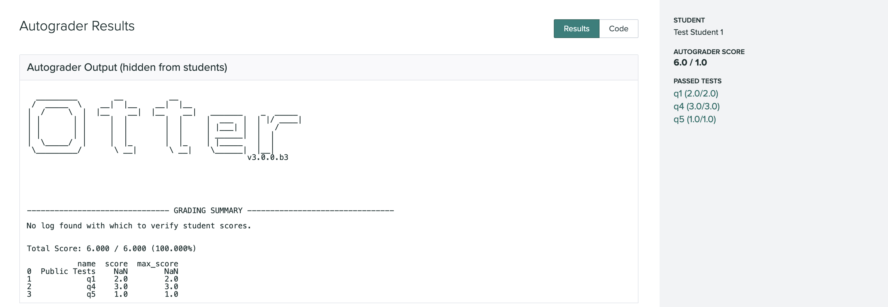

# Gradescope Results Format

This section details how the autograder runs and how results are displayed to students and instructors on Gradescope. When a student submits to Gradescpe, the autograder does the following:

1. Copies the tests and support files from the autograder source
2. Globs the first IPYNB file and assumes this to be the submission to be graded
3. Corrects instances of `otter.Notebook` for different test paths using a regex
4. Reads in the log from the submission if it exists
5. Grades the notebook, globbing all tests and grading from the log if specified
6. Looks for discrepancies between the logged scores and the autograder scores and warngs about these if present
7. If indicated, exports the notebook to a PDF and POSTs this notebook to the other Gradescope assignment
8. Generates the JSON object for Gradescope's results
9. Makes adjustments to the scores and visibility based on the configurations
10. Writes the JSON to the results file
11. Prints the results as a dataframe to stdout

## Instructor View

Once a student's submission has been autograded, the Autograder Results page will show the stdout of the grading process in the "Autograder Output" box and the student's score in the side bar to the right of the output. The stdout includes information from verifying the student's scores against the logged scores, a dataframe that contains the student's score breakdown by question, and a summary of the information about test output visibility:

Note that the above submission shows a discrepancy between the autograder score and the logged score (the line printed above the dataframe). If there are no discrepancies, the stdout will say so:

Below the autograder output, each test case is broken down into boxes. Based on the passing of public and hidden tests, there are three possible cases:

* If a public test is failed, there is a single box for the test called `{test name} - Public` that displays the failed output of the test. 

* If all public tests pass but a hidden test fails, there are two boxes: one called `{test name} - Public` that shows `All tests passed!` and a second called `{test name} - Hidden` that shows the failed output of the test. 

* If all tests pass, there are two boxes, `{test name} - Public` and `{test name} - Hidden`, that both show `All tests passed!`. 

Note that these examples award points with a public test multiplier of 0.5; if it had been 0, all of the `{test name} - Public` tests (except failed ones, which are worth full points always) would be worth 0 points Instructors will be able to see _all_ tests. The invisibility of a test to students is indicated to instructors by the  icon (all tests with this icon are hidden to students).

## Student View

On submission, students will only be able to see the results of those test cases for which `test["suites"][0]["cases"][<int>]["hidden"]` evaluates to `True` (see [Test Files](../../test_files/index.md) for more info). If `test["suites"][0]["cases"][<int>]["hidden"]` is `False` or not specified, then that test case is hidden.

If `--show-stdout` was specified when constructing the autograder zipfile, then the autograder output from above will be shown to students _after grades are published on Gradescope_. Students will **not** be able to see the results of hidden tests nor the tests themselves, but they will see that they failed some hidden test in the printed DataFrame from the stdout. If `--show-hidden` was passed, students will also see the failed otput of the failed hidden tests (again, once grades are published).
